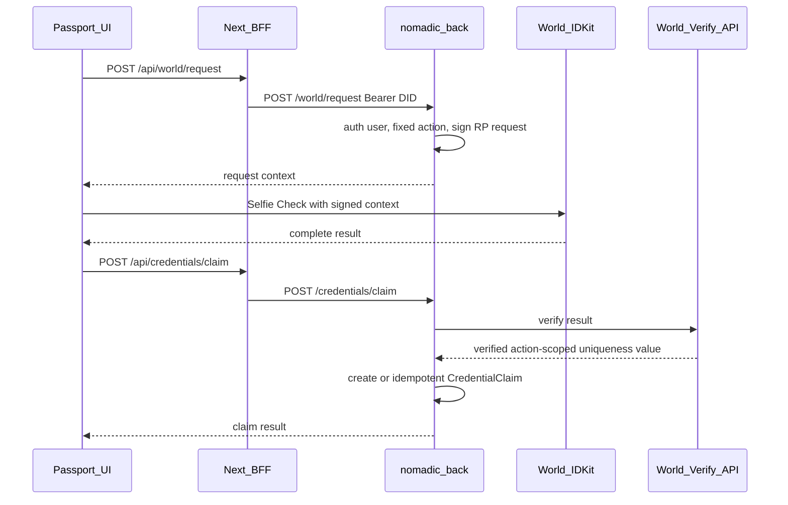

# Lisbon Architecture — ETHGlobal Lisbon 2026

> Hybrid architecture for the Nomadic Passport MVP.  
> Companion to [`LISBON_MVP.md`](./LISBON_MVP.md) and [`LISBON_ROUTES.md`](./LISBON_ROUTES.md).  
> Documentation only — no migrations, installs, or application code in this pass.

ENS references:

- Universal Resolver: https://docs.ens.domains/resolvers/universal/
- ENSv2 preview: https://ens.domains/ensv2

---

## 1. Architectural stance

```text
Evolve existing repos.
Do not create a new app.
Do not create a monorepo.
Add the minimum new tables and endpoints.
Hide legacy surfaces from the demo path; do not delete them.
```

**Hybrid split (locked):**

| Layer | Responsibilities |
| --- | --- |
| **Frontend** (`nomadic-front`) | Passport UI; **all P0 ENS resolution**; World IDKit client flow; BFF proxies that resolve ENS→wallet before calling Express; demo navigation |
| **Backend** (`nomadic-back`) | Magic DID auth; user persistence; proposed wallet bind after Magic spike; World **RP request signing** + proof verification; uniqueness; Passport JSON **by wallet address only** |

---

## 2. Frontend responsibilities

- Keep Magic login ([`components/LoginUser.tsx`](../components/LoginUser.tsx), [`contexts/UserContext.tsx`](../contexts/UserContext.tsx)).
- Add `/passport`, `/p/[identifier]`, and Lisbon claim UI with public-disclosure copy.
- Perform ENS normalization, name→address, address→verified primary name, avatar resolution, and ENSv2 readiness tests.
- Request World RP context from backend; open IDKit; send complete result to claim endpoint.
- BFF `GET /api/passport/public/[identifier]` must resolve ENS to a normalized wallet **before** calling Express.
- Surface legacy `/user-proofs` and journeys only as secondary / hidden-from-demo-nav paths.

**Not frontend responsibilities:** storing uniqueness keys as source of truth; verifying World proofs; trusting raw client wallet strings for ownership; calling Express with ENS names.

---

## 3. Backend responsibilities

- Continue Magic DID validation on protected routes.
- Users remain email-persisted.
- After Magic wallet metadata spike: optionally add nullable `User.publicAddress` and centralize extraction from the **real** metadata shape of the installed SDKs.
- Implement `POST /world/request` (RP signing) and `POST /credentials/claim` (verify + persist).
- Implement `CredentialClaim` **after** World readiness spike (do not freeze migration field formats early).
- Serve `GET /passport/me` and `GET /passport/public/:address` (wallet only).
- **Never resolve ENS in P0.**
- Do **not** redesign `UserProofs` or Journey tables.

---

## 4. Auth flow

```text
Magic email OTP (client)
  → DID token
  → POST /validaOTP (existing) with Bearer DID
  → User upsert by email
  → Optional: extract publicAddress from Magic-validated metadata (after spike)
  → Frontend stores didToken + metadata in localStorage/context (existing)
```

Protected Lisbon endpoints require the same Bearer DID pattern as existing proxies.

**Claim / RP auth rule:** authenticated `userId` comes from the verified DID session — never from the request body.

**Logging rule:** never log complete Magic metadata, DID tokens, email addresses, or RP signing secrets.

---

## 5. ENS strategy — ENSv2-ready application integration

### 5.1 Locked statement

```text
Nomadic uses an ENSv2-compatible resolution library and the canonical
Universal Resolver.

Nomadic does not depend directly on draft ENSv2 registry contracts for P0.
```

Reasons:

- draft ENSv2 Permissioned Registry / Resolver / ETH Registrar / migration contracts are still subject to change;
- app-developer deployment guidance is not final enough for a demo-critical direct contract dependency;
- Nomadic only needs application-level resolution, not registration or registry management.

### 5.2 Intended libraries (install later — not in this docs task)

| Package | Plan |
| --- | --- |
| `@ensdomains/ensjs` | **4.2.3 or newer** (preferred high-level ENS integration; UR path) |
| `viem` | **2.35.0 or newer** as ENSjs transport/client foundation |
| Wagmi | **Do not** add solely for ENS |

**Current lockfile observation (pre-install):** transitive `viem@2.23.2` via Privy; no `@ensdomains/ensjs` yet. Before installing:

1. Inspect direct and transitive `viem` versions.
2. Choose mutually compatible stable versions meeting the floors above.
3. Record exact versions in `package-lock.json`.
4. Prefer ENSjs; use viem ENS helpers directly only when ENSjs does not expose a required P0 operation cleanly.
5. Use an Ethereum **Mainnet** public client for ENS resolution.
6. Use the canonical Universal Resolver through the supported library — **do not** manually hardcode draft ENSv2 contract deployment addresses.

### 5.3 Ownership boundaries

```text
Next.js / nomadic-front:
- ENS normalization;
- ENS name → address resolution;
- address → verified primary name resolution;
- avatar resolution;
- ENSv2 readiness tests.

Express / nomadic-back:
- receives normalized wallet addresses only;
- never resolves ENS in P0;
- serves Passport JSON by wallet address.
```

### 5.4 P0 ENS capabilities

**Private Passport** (trusted wallet address):

1. Reverse-resolve primary ENS name.
2. Verify the name forward-resolves to the same wallet.
3. Fetch avatar only after a valid verified name exists.
4. Display verified name + avatar.
5. On any validation/RPC/avatar failure → truncated/normalized wallet (avatar failure never fails the Passport).

**Public Passport** (`/p/[identifier]`):

1. Normalize identifier.
2. If domain-like, attempt ENS resolution (not `.eth`-only): `.eth` names, subnames, DNS names imported into ENS.
3. Resolve name → wallet; then call Express with normalized wallet.
4. If already a wallet, use it directly.
5. Do not claim every dot-separated string will resolve.
6. Wallet remains the canonical backend retrieval key.

### 5.5 ENS data ownership and privacy

- ENS data is **network-derived** and **not persisted** in Nomadic DB for P0.
- Do not add ENS name columns, avatar columns, cached text records, or ENS ownership claims.
- Database stores only the trusted wallet binding required for the Passport.
- ENS names are aliases and may change owner.

### 5.6 Optional direct ENSv2 experimentation

**P2 / deferred.** Reconsider only when:

- official deployment addresses are published;
- interfaces are sufficiently stable;
- ENS team confirms recommended hackathon integration;
- P0 Passport, ENS resolution, and World claim already work.

Possible later experiments: ENSv2 subname issuance, Permissioned Resolver records, community Passport subnames. **Not** P0 acceptance criteria.

---

## 6. Wallet trust boundary

```text
For P0, publicAddress should be sourced from server-validated Magic metadata
when available and persisted on User — only after the Magic readiness spike.

The credential claim endpoint must not blindly trust an arbitrary walletAddress
provided by the request body.
```

`User.publicAddress String? @unique` remains a **proposed** additive field until the spike confirms Magic Admin/client metadata for the installed versions.

If Magic does not return a stable address:

```text
- private Passport can still show session identity;
- public Passport-by-wallet waits for a reliable bind;
- do not invent client-trusted wallet uniqueness constraints.
```

---

## 7. World Selfie Check flow (with RP signing)



**Fixed allowlisted action:** `claim_nomadic_lisbon_2026`  
**Stable signal for RP request:** preferably `User.id` (server-derived).  
**Never** expose or log the RP signing secret.

**Honesty:**

- Do not describe Selfie Check as absolute proof that a person is globally unique.
- Uniqueness guarantee: the same **verified World identity** cannot create a second claim for the same credential action.
- Do not invent final World field names before checking the current beta SDK/API.

**Privacy — do not store:** selfie images; full World payloads; biometrics; document data.

**Provider field:** `verificationProvider = WORLD_SELFIE_CHECK`  
**Uniqueness field:** neutral `uniquenessKey` (format confirmed in World spike).

**Idempotency:**

| Case | Behaviour |
| --- | --- |
| Same authenticated user already owns `credentialKey` | **200** existing claim (`idempotent: true`) |
| `uniquenessKey` already used by another user for same `credentialKey` | **409** |
| Invalid World result | **400** |
| Unauthenticated | **401** |
| World unavailable | **503** + honest UI (no deployable bypass) |

---

## 8. Data model (additive, after spikes)

### 8.1 Why not `UserProofs`?

Allows duplicates; no uniqueness fields; shaped for legacy wallet checks.

### 8.2 Proposed `CredentialClaim` (freeze only after World spike)

```prisma
model CredentialClaim {
  id                   String   @id @default(uuid())
  userId               String
  credentialKey        String
  walletAddress        String
  uniquenessKey        String
  verificationProvider String
  metadata             Json?
  claimedAt            DateTime @default(now())
  createdAt            DateTime @default(now())
  updatedAt            DateTime @updatedAt

  @@unique([userId, credentialKey])
  @@unique([uniquenessKey, credentialKey])
  @@index([walletAddress])
}
```

- **No** wallet unique constraint until ownership is proven.
- **No** `status` in P0.
- `metadata` minimal only.

### 8.3 Proposed User field (after Magic spike)

```prisma
publicAddress String? @unique
```

### 8.4 No Passport table / no ENS columns

```text
User (+ optional publicAddress)
  + ENS resolved at frontend only
  + CredentialClaim[]
  + optional legacy UserProofs summary
```

---

## 9. Passport aggregation

### Private `GET /passport/me`

1. Authenticate DID → `userId`.
2. Load User (`publicAddress` when present — never required email in FE public views).
3. Load `CredentialClaim` for `userId`.
4. Optionally load legacy proofs for secondary section.
5. Return JSON; frontend attaches verified ENS.

### Public `GET /passport/public/:address`

1. Accept **normalized wallet address only**.
2. Lookup by `walletAddress` / `User.publicAddress`.
3. Return public fields only (**no email**).
4. `404` if nothing publicable.

Frontend/BFF owns ENS→address conversion for `/p/[identifier]`.

---

## 10. Data ownership

| Data | Owner of truth | Writers | Readers |
| --- | --- | --- | --- |
| User email / Magic identity | Backend | Backend (OTP) | Backend; private FE session |
| `User.publicAddress` (proposed) | Backend after Magic spike | Backend | FE Passport; public lookup key |
| ENS name/avatar | ENS network via Universal Resolver | Nobody in Nomadic DB (P0) | Frontend only |
| Legacy `UserProofs` | Backend | Existing proof routes | FE secondary section |
| `CredentialClaim` | Backend | Claim endpoint | Private + public Passport |
| World proof payload | Ephemeral | Verified then discarded | Never stored raw |
| `uniquenessKey` | Backend after World verify | Claim endpoint | Uniqueness enforcement |
| RP signing secret | Backend env | Never returned | Sign endpoint only |

---

## 11. Legacy surfaces

| Surface | Lisbon treatment |
| --- | --- |
| Journeys | Keep; hide from primary demo nav; not on public Passport P0 |
| Houses / NACC / single-use ID | Keep; hide from demo |
| `/user-proofs` + Privy | Legacy; secondary at most |
| `WORLD_ID_POH` enum/icons | Historical only |

---

## 12. Environment / secrets (names only)

- Existing: `NEXT_PUBLIC_MAGIC_PUBLISHABLE_KEY`, `NEXT_PUBLIC_PRIVY_APP_ID`, `NEXT_PUBLIC_NOMADIC_API_URL`
- New: World RP / verify credentials as required by beta docs; optional Mainnet ENS RPC URL

**Forbidden:** `DEMO_WORLD_BYPASS` or any preview/production-toggleable fake claim mint.

Local-only World test adapters: development builds only; impossible to enable in preview/production.

---

## 13. Assumptions still requiring runtime verification

1. Magic Admin/client metadata shape and stable address for installed SDK versions.
2. World Selfie Check Beta: IDKit request context shape, verify API, action-scoped uniqueness field name.
3. Compatible `@ensdomains/ensjs` + `viem` versions with existing Privy transitive `viem`.
4. Universal Resolver readiness check via `ur.integration-tests.eth`.
5. Public Passport behaviour when email user has no bound wallet yet.
6. Wallet address normalization (casing) for indexes/lookups.
