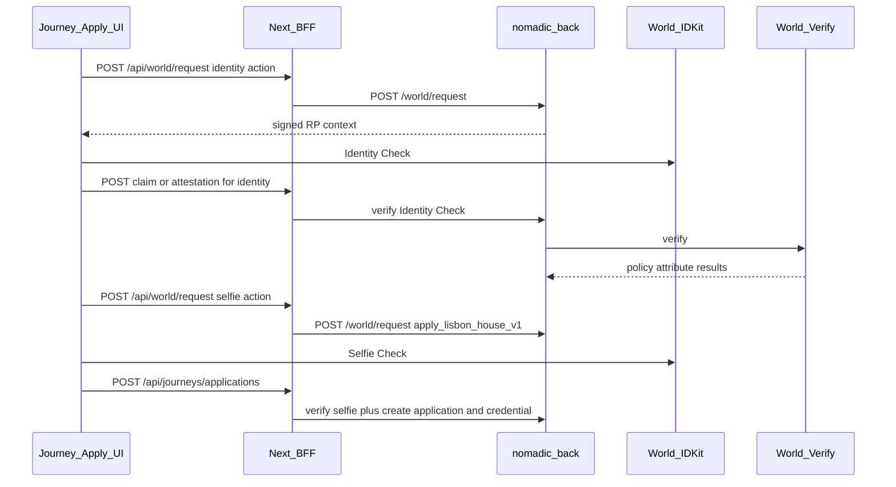

# Lisbon Architecture — ETHGlobal Lisbon 2026

> Technical design for the Journey-centered Lisbon slice.  
> Product north star: [`PRODUCT_VISION.md`](./PRODUCT_VISION.md)  
> MVP: [`LISBON_MVP.md`](./LISBON_MVP.md) · Routes: [`LISBON_ROUTES.md`](./LISBON_ROUTES.md)  
> Documentation only in this revision — no migrations or installs here.

ENS references: https://docs.ens.domains/resolvers/universal/ · https://ens.domains/ensv2

---

## 1. Stance

```text
Evolve existing repos. No new app. No monorepo.
Additive tables and endpoints only.
Hide legacy demo distractions; do not delete them.
Nomadic stays Journey + Passport — not a World or ENS demo.
```

**Hybrid split:**

| Layer | Responsibilities |
| --- | --- |
| **Frontend** (`nomadic-front`) | Passport UI; Journey discover/detail/policy disclosure/apply UX; ENS resolve/display; World IDKit client (Identity + Selfie); BFF; demo nav |
| **Backend** (`nomadic-back`) | Magic DID auth; seed/read Journey + policy; World RP signing + verify; applications; CredentialClaim uniqueness; Passport JSON **by wallet** |

---

## 2. Frontend responsibilities

- Keep Magic login + Passport shell (P0.1 done: `/passport`, nav).
- Present seeded Nomadic Lisbon House Journey + `lisbon_house_policy_v1` disclosure.
- Run World **Identity Check** then **Selfie Check** client flows; never treat client success as final.
- Submit application; show credential on Passport.
- All P0 ENS resolution (normalize, forward, reverse+verify, avatar); BFF resolves ENS→wallet before Express public Passport.
- Demote legacy proofs/journeys UI from primary demo path without deleting routes.

**Not FE:** uniqueness source of truth; World verify; trusting client wallet for ownership; Express calls with ENS names.

---

## 3. Backend responsibilities

- Magic DID validation; optional `User.publicAddress` after Magic spike.
- Serve seeded Journey + policy metadata (additive; do not redesign all Journey tables).
- `POST /world/request` for allowlisted actions (identity policy + selfie continuity).
- Verify World results; store minimal attestations; create `JourneyApplication` + `CredentialClaim`.
- `GET /passport/me`, `GET /passport/public/:address` (wallet only).
- **Never resolve ENS in P0.** Never store document/biometric PII.

---

## 4. Auth flow

```text
Magic email OTP → DID → POST /validaOTP → User by email
→ optional publicAddress from Magic-validated metadata (after spike)
→ Bearer DID on protected Lisbon routes
```

`userId` always from verified DID — never from body.  
Never log DID tokens, emails, full Magic metadata, or RP secrets.

---

## 5. Journey + policy (P0 minimalism)

**Locked:** do not rebuild a community CMS or redesign all Prisma Journey models.

P0 approach:

- Seed **one** Journey representing Nomadic Lisbon House (existing Journey fields where possible).
- Attach policy as versioned metadata, e.g. `policyKey = lisbon_house_policy_v1` + JSON attribute list on Journey or a small additive `EligibilityPolicy` row.
- Application + credential tables are **new** additive models.

```text
Journey (seeded)
  + policyKey / policyVersion / policyAttributes (JSON)
JourneyApplication (new)
  userId, journeyId, policyVersion, status, attestation refs, timestamps
CredentialClaim (new)
  userId, credentialKey, walletAddress, uniquenessKey, verificationProvider, metadata
```

---

## 6. World dual-check flow



| Action (examples) | Purpose |
| --- | --- |
| Policy Identity Check action(s) | Prove `lisbon_house_policy_v1` attributes (exact action IDs from World spike) |
| `apply_lisbon_house_v1` | Selfie continuity — one verified identity per Journey apply |

**Store:** policySatisfied summary, provider, timestamps, policyVersion, uniquenessKey.  
**Do not store:** selfies, documents, legal name, DOB, full payloads.

**Idempotency:** same user re-submit → 200 existing application/claim; uniqueness collision across users → 409.  
**Unavailable:** 503 + honest UI; no `DEMO_WORLD_BYPASS`. Local-only adapters cannot enable in preview/prod.

Attribute feasibility is **confirmed in the World spike**; UI must not fake unconfirmed attributes.

---

## 7. ENS strategy (Sepolia ENSv2 issuance — locked)

```text
Issuance + hierarchical roles: Sepolia ENSv2 UserRegistry / PermissionedRegistry
Read path in demo: Sepolia public client + Universal Resolver
Library readiness CI: Mainnet ur.integration-tests.eth (Track A)
Backend key: wallet   Product identity: Passport ENS name
```

| Capability | Phase |
| --- | --- |
| Mint `victor.nomadic-passport.eth` on onboarding | **P0** (Sepolia) |
| Primary name + bidirectional verify; records drive UI | **P0** |
| Mint `lisbon-house.victor…` after World; public discovery | **P0** |
| Scoped issuer permission + revoke revert demo | **P0** |
| Mainnet UR readiness probes | **P0** (CI) |
| contenthash / IPFS manifest | **P1** |
| CCIP-Read dynamic reputation | **P2** |

**Ownership:**

```text
Next.js: Sepolia mint adapters + resolve/records/primary name + public /p/[name]
Express: wallet addresses only; CredentialClaim / VerificationSession
UI: Sepolia / testnet badge on every ENS surface
```

Canonical cycle: [ENS_SEPOLIA_V2_CYCLE.md](./ENS_SEPOLIA_V2_CYCLE.md).  
Packages: `@ensdomains/ensjs` ≥ 4.2.3; `viem` ≥ 2.35 (installed 4.3.1 / 2.43.0). Pin Sepolia v2 factory addresses in env (they rotate).

---

## 8. Data model (additive, after spikes)

### CredentialClaim

```prisma
model CredentialClaim {
  id                   String   @id @default(uuid())
  userId               String
  credentialKey        String   // NOMADIC_LISBON_HOUSE_ELIGIBLE
  walletAddress        String
  uniquenessKey        String
  verificationProvider String
  metadata             Json?    // policyVersion, journeyId — no PII
  claimedAt            DateTime @default(now())
  createdAt            DateTime @default(now())
  updatedAt            DateTime @updatedAt

  @@unique([userId, credentialKey])
  @@unique([uniquenessKey, credentialKey])
  @@index([walletAddress])
}
```

No wallet unique constraint until ownership is proven. No `status` in P0.

### JourneyApplication (sketch)

```prisma
model JourneyApplication {
  id            String   @id @default(uuid())
  userId        String
  journeyId     String
  policyVersion String
  status        String   // SUBMITTED | ACCEPTED | ...
  metadata      Json?
  createdAt     DateTime @default(now())
  updatedAt     DateTime @updatedAt

  @@unique([userId, journeyId])
  @@index([journeyId])
}
```

Exact fields freeze after World + product spike. Link application to claims via metadata or FK later.

### User.publicAddress

Proposed `String? @unique` **after** Magic metadata spike confirms stable server-validated address.

### No Passport table / no ENS columns

Passport remains a read model: User + claims + optional legacy proofs + FE ENS.

---

## 9. Passport aggregation

- `GET /passport/me` — Bearer; user + credentials (+ optional legacy proofs / applications summary).  
- `GET /passport/public/:address` — wallet only; no email.  
- FE attaches verified ENS for display.

---

## 10. Data ownership

| Data | Truth | Notes |
| --- | --- | --- |
| Magic user / email | Backend | Private; never on public Passport |
| `publicAddress` | Backend after spike | Canonical public key |
| Journey seed + policy | Backend | P0 seeded |
| Applications / claims | Backend | After World verify |
| ENS name/avatar | ENS network | FE only in P0 |
| World payloads | Ephemeral | Discard after verify |
| RP signing secret | Backend env | Never returned |

---

## 11. Legacy

| Surface | Treatment |
| --- | --- |
| Existing Journey CRUD | Keep; Lisbon seeds/adapts one Journey for demo |
| `requiredProofs` / UserProofs | Legacy; secondary on Passport; not the policy engine |
| House login / NACC / single-use | Hidden from demo nav |
| Prior `NOMADIC_LISBON_2026` docs | Superseded by `NOMADIC_LISBON_HOUSE_ELIGIBLE` journey credential |

---

## 12. Assumptions requiring runtime verification

1. Magic metadata → stable `publicAddress`.  
2. World Identity Check attribute coverage for policy v1.  
3. World Selfie Check action uniqueness field name.  
4. ensjs ↔ viem ↔ Privy version compatibility.  
5. Universal Resolver readiness (`ur.integration-tests.eth`).  
6. How much existing Journey API can serve a public seeded house without redesign.
