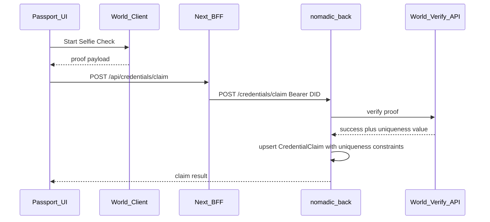

# Lisbon Architecture — ETHGlobal Lisbon 2026

> Hybrid architecture for the Nomadic Passport MVP.  
> Companion to [`LISBON_MVP.md`](./LISBON_MVP.md) and [`LISBON_ROUTES.md`](./LISBON_ROUTES.md).  
> Documentation only — no migrations or code in this pass.

---

## 1. Architectural stance

```text
Evolve existing repos.
Do not create a new app.
Do not create a monorepo.
Add the minimum new tables and endpoints.
Hide legacy surfaces from the demo path; do not delete them.
```

**Hybrid split (locked):**

| Layer | Responsibilities |
| --- | --- |
| **Frontend** (`nomadic-front`) | Passport UI; ENS resolve/display/lookup UX; World Selfie Check **client** flow; BFF proxies; demo navigation (promote Passport, demote legacy) |
| **Backend** (`nomadic-back`) | Magic DID auth; user persistence; persist `publicAddress` when Magic metadata provides it; World proof **server** verification; uniqueness; private + public Passport aggregates |

---

## 2. Frontend responsibilities

- Keep Magic login ([`components/LoginUser.tsx`](../components/LoginUser.tsx), [`contexts/UserContext.tsx`](../contexts/UserContext.tsx)).
- Add `/passport`, `/p/[identifier]`, and Lisbon claim UI.
- Resolve ENS **from wallet** for display; on public routes resolve ENS name → wallet, then load by wallet.
- Run World Selfie Check client SDK/flow; send proof material to backend; never treat client success alone as claim finality.
- Proxy new backend calls through Next route handlers under `app/api/` (same pattern as existing `app/api/auth/*`).
- Surface legacy `/user-proofs` and journeys only as secondary / hidden-from-demo-nav paths.

**Not frontend responsibilities:** storing uniqueness keys as source of truth; verifying World proofs; trusting raw client wallet strings for ownership.

---

## 3. Backend responsibilities

- Continue Magic DID validation on protected routes.
- Users remain email-persisted; **additively** persist `publicAddress String? @unique` on `User` when Magic Admin metadata supplies a stable address (confirm before migration).
- Implement `CredentialClaim` (see §7).
- Verify World Selfie Check proofs server-side using the beta API once confirmed.
- Enforce uniqueness: one user per credential; one uniqueness key per credential.
- Serve private Passport aggregate and public Passport-by-wallet aggregate.
- Do **not** redesign `UserProofs` or Journey tables for Lisbon.

---

## 4. Auth flow

```text
Magic email OTP (client)
  → DID token
  → POST /validaOTP (existing) with Bearer DID
  → User upsert by email
  → Prefer extracting publicAddress from Magic-validated metadata
  → Persist User.publicAddress when available
  → Frontend stores didToken + metadata in localStorage/context (existing)
```

Protected Lisbon endpoints require the same Bearer DID pattern as existing journey/proof proxies.

**Claim auth rule:** the authenticated `userId` comes from the verified DID session — never from the request body.

---

## 5. Wallet and ENS flow

### 5.1 Canonical key

```text
Wallet address = canonical Passport key
ENS name       = human-readable alias (can change owner)
```

### 5.2 Private Passport (`/passport`)

```text
session user
  → User.publicAddress (server) preferred over client-only localStorage
  → ENS reverse resolve(address) → name + avatar
  → aggregate credentials for userId / wallet
```

### 5.3 Public Passport (`/p/[identifier]`)

```text
identifier
  → if looks like ENS: resolve name → address
  → else normalize as address
  → load public aggregate by walletAddress
  → 404 if no publicable Passport (no bound wallet / no data)
```

### 5.4 Trust boundary

```text
For P0, publicAddress should be sourced from server-validated Magic metadata
when available and persisted on User.

The credential claim endpoint must not blindly trust an arbitrary walletAddress
provided by the request body.
```

If Magic does not return a stable address:

```text
Fallback (documented):
- private Passport can still show session identity;
- public Passport-by-wallet becomes available only after a claim (or later
  ownership proof) that binds a wallet through a reliable mechanism;
- do not invent client-trusted wallet uniqueness constraints in the meantime.
```

ENS libraries may run client-side (public RPC) or via a thin BFF; either is acceptable if the **retrieval key** remains the wallet after resolution.

---

## 6. World Selfie Check claim flow



**Privacy:** store only the minimum needed for uniqueness and technical audit.

Do **not** store:

- selfie images;
- full World payloads;
- biometrics;
- document data.

**Provider field:** `verificationProvider = WORLD_SELFIE_CHECK` (string/enum).

**Uniqueness field:** neutral `uniquenessKey` — the stable action-scoped uniqueness value returned or derived from the verified World Selfie Check response. Final name/format must be confirmed against the World beta API before implementing the migration. Do not hard-lock the schema name to `worldNullifier` until that contract is known.

**Idempotency:**

| Case | Behaviour |
| --- | --- |
| Same authenticated user already owns `credentialKey` | Return **200** with existing claim |
| `uniquenessKey` already used by another user for same `credentialKey` | **409** conflict |
| Invalid / unverified World proof | **400** |
| Unauthenticated | **401** |
| World verify service down | **503** + honest UI (no deployable bypass) |

---

## 7. Data model (additive)

### 7.1 Why not `UserProofs`?

Backend findings: `UserProofs` allows duplicate rows, has no uniqueness/nullifier fields, and is shaped for legacy wallet checks. Lisbon uniqueness must not be forced into that table.

### 7.2 Recommended `CredentialClaim`

```prisma
model CredentialClaim {
  id                   String   @id @default(uuid())
  userId               String
  credentialKey        String
  walletAddress        String
  uniquenessKey        String
  verificationProvider String
  metadata             Json?
  claimedAt            DateTime @default(now())
  createdAt            DateTime @default(now())
  updatedAt            DateTime @updatedAt

  @@unique([userId, credentialKey])
  @@unique([uniquenessKey, credentialKey])
  @@index([walletAddress])
}
```

Notes:

- **No** `@@unique([walletAddress, credentialKey])` until wallet ownership is proven — a unique wallet constraint would let a client submit someone else’s address and block them.
- **No** `status` field in P0 (only claimed rows exist). Add status later for revocation/expiry/pending.
- `metadata` is optional and minimal (e.g. credential display version, verification timestamp) — never biometrics.
- `walletAddress` is indexed for public lookup; value must come from trusted binding rules (§5.4), not blind body trust.

### 7.3 Recommended additive User field

```prisma
// on existing User model — confirm Magic Admin stability first
publicAddress String? @unique
```

### 7.4 No Passport table

Passport remains a **read model** composed at query time:

```text
User
  + publicAddress
  + ENS (resolved at edge/UI or BFF; not necessarily stored)
  + CredentialClaim[] for user / wallet
  + optional legacy UserProofs summary (secondary UI only)
```

---

## 8. Passport aggregation flow

### Private `GET /passport/me`

1. Authenticate DID → `userId`.
2. Load User (`email`, `publicAddress`, …).
3. Load `CredentialClaim` where `userId`.
4. Optionally load legacy proofs for secondary section.
5. Return JSON; frontend attaches ENS client-side (or BFF resolve).

### Public `GET /passport/public/:identifier`

1. Resolve identifier → wallet (ENS or address).
2. Find claims / user binding by `walletAddress` (and/or `User.publicAddress`).
3. Return **public** fields only (no email).
4. 404 if nothing publicable.

---

## 9. Data ownership

| Data | Owner of truth | Writers | Readers |
| --- | --- | --- | --- |
| User email / Magic identity | Backend | Backend (OTP) | Backend; FE session copy |
| `User.publicAddress` | Backend (Magic-validated) | Backend | FE Passport, public lookup |
| ENS name/avatar | ENS network | Nobody in Nomadic DB (P0) | FE / optional BFF cache |
| Legacy `UserProofs` | Backend | Existing proof verify routes | FE secondary section |
| `CredentialClaim` | Backend | Claim endpoint only | Private + public Passport |
| World proof payload | Ephemeral | Verified then discarded | Never stored raw |
| `uniquenessKey` | Backend after World verify | Claim endpoint | Uniqueness enforcement |

---

## 10. Legacy surfaces

| Surface | Lisbon treatment |
| --- | --- |
| Journeys | Keep code; hide from primary demo nav; not on public Passport P0 |
| Hacker houses / NACC / single-use ID | Keep; hide from demo |
| `/user-proofs` + Privy wallet verify | Keep as legacy; secondary on Passport at most |
| `WORLD_ID_POH` enum / icons | Historical only; Lisbon uses Selfie Check + `CredentialClaim` |

---

## 11. Environment / secrets (names only)

Likely names (values never committed):

- Existing: `NEXT_PUBLIC_MAGIC_PUBLISHABLE_KEY`, `NEXT_PUBLIC_PRIVY_APP_ID`, `NEXT_PUBLIC_NOMADIC_API_URL`
- New (backend): World verify credentials / app id as required by beta docs
- New (frontend): World client config as required by beta docs
- Optional: public ENS RPC URL

**Forbidden:** `DEMO_WORLD_BYPASS` (or any production/preview-toggleable fake claim mint).

Local development may use a **local-only test adapter** that is compile-time or env-gated to `development` and cannot be enabled in preview/production builds.

---

## 12. Risks to confirm before coding migrations

1. Magic Admin: stable `publicAddress` in metadata?
2. World Selfie Check Beta: exact proof shape and uniqueness field?
3. Public Passport when user has email but no bound wallet yet.
4. Normalization of wallet addresses (casing) for indexes/lookups.
