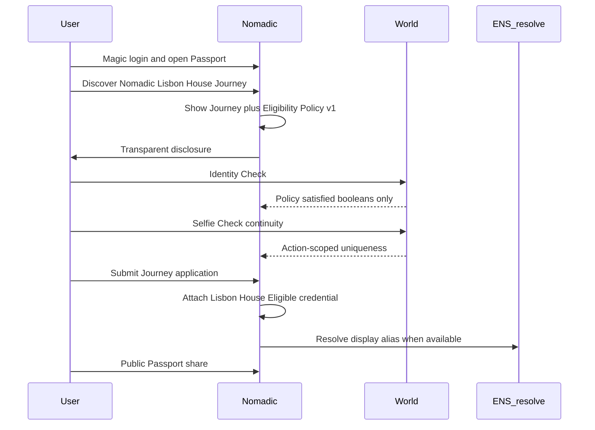

# Lisbon MVP — ETHGlobal Lisbon 2026

> Status: **hackathon product slice** (documentation).  
> North star: [`PRODUCT_VISION.md`](./PRODUCT_VISION.md)  
> Also: [`FRONTEND_AUDIT.md`](./FRONTEND_AUDIT.md), [`PROJECT_CONTEXT.md`](./PROJECT_CONTEXT.md)  
> Branch: `lisboa2026`  
> **Supersedes** the earlier Passport-only / Selfie-only-claim framing of Lisbon P0.

Nomadic must remain a portable community passport — **not** a World KYC app or an ENS minting demo.

---

## 1. What we are shipping

A Journey-first demo of Nomadic:

1. User signs in with existing **Magic** auth and opens their **Passport** (shell already exists — P0.1).
2. User discovers the seeded **Nomadic Lisbon House** Journey.
3. User reviews a transparent **Eligibility Policy**.
4. User completes **World Identity Check** (private policy attributes) and **World Selfie Check** (continuity).
5. User submits a Journey **application**.
6. Nomadic attaches a portable credential: **Nomadic Lisbon House — Eligible**.
7. Credential appears on the Passport; user can share a **public Passport** URL.

```text
Discover a place
→ understand its community
→ apply privately
→ (participate)
→ carry the experience forward on the Passport
```

**Continuity note:** Earlier Lisbon drafts centered on a standalone `NOMADIC_LISBON_2026` Selfie-only claim. That is **no longer the main P0 story**. The primary credential is journey/policy scoped: `NOMADIC_LISBON_HOUSE_ELIGIBLE`.

---

## 2. Five product blocks (Lisbon slice)

Aligned with [`PRODUCT_VISION.md`](./PRODUCT_VISION.md):

### 2.1 Passport

Aggregated view — **not** a DB entity.

- Routes: `/passport` (private), `/p/[identifier]` (public).
- Shows wallet (canonical), ENS alias when resolved, credentials, later journeys/communities.
- **P0.1 complete** in frontend: shell + demo nav using Magic `UserContext` (no ENS/World/API yet).

### 2.2 Community

P0 seed: **Nomadic Lisbon House** (not a full community CMS).

### 2.3 Journey

P0 seed: **Lisbon Hacker House** temporary opportunity (dates, capacity, description, apply).  
Reuse existing Journey UI concepts; do not delete legacy journey code.

### 2.4 Eligibility Policy

P0: `lisbon_house_policy_v1` presented on the Journey.

Intended required attributes (product intent):

- 18 or older;
- eligible jurisdiction;
- unique verified document;
- optional: prior Nomadic / hacker / ETHGlobal-style credentials when available.

**Implementation gated** on the World Identity Check capability spike. Docs and UI must mark attributes as **confirmed** vs **aspirational** after the spike — do not fake attribute results.

### 2.5 Credential

```text
credentialKey:  NOMADIC_LISBON_HOUSE_ELIGIBLE
displayName:    Nomadic Lisbon House — Eligible
description:    Eligibility credential for Nomadic Lisbon House after privately
                satisfying Lisbon House Policy v1 during ETHGlobal Lisbon 2026.
```

Not “ETHGlobal Participant” without organizer evidence.

---

## 3. World and ENS roles (Lisbon)

### World

| Check | Job in Nomadic |
| --- | --- |
| **Identity Check** | Private eligibility for policy attributes → `policySatisfied` bits only |
| **Selfie Check** | Continuity / one application per verified identity for this Journey action |

Selfie allowlisted action (example): `apply_lisbon_house_v1`.

Nomadic does **not** store legal name, document numbers, selfies, or full World payloads.

### ENS

| Stage | Lisbon |
| --- | --- |
| Resolve / display primary name + avatar (ENSv2-ready ENSjs + Universal Resolver) | **P0** |
| Credential subnames / hierarchy | **P1/P2** |
| Scoped issuer delegation | **P2 / deferred** |

Wallet remains the canonical backend key. Express never resolves ENS in P0.

---

## 4. Exact user flow (demo script)

```text
1. Magic login → /passport (existing shell).
2. Discover Nomadic Lisbon House Journey.
3. Open Journey detail: dates, capacity, description, policy summary, Apply.
4. Policy disclosure: what will be proven; what Nomadic will NOT receive.
5. World Identity Check → backend verifies → policy attestation stored minimally.
6. World Selfie Check → continuity / uniqueness for apply_lisbon_house_v1.
7. Submit application linked to Journey + user + policyVersion + attestations.
8. Receive / attach NOMADIC_LISBON_HOUSE_ELIGIBLE on Passport.
9. Share /p/<ens-or-wallet>; visitor sees public credential (no email).
```



---

## 5. In scope (P0)

- Keep Magic auth; Passport shell (done) + real Passport data APIs.
- One seeded Community/Journey + policy presentation UI.
- World Identity Check + Selfie Check (after readiness spike).
- Journey application + `CredentialClaim` (additive backend).
- ENS resolve/display on Passport / public route (ENSv2-ready libraries).
- Public Passport by wallet; ENS alias resolved in Next.js only.
- Hide house-login/NACC/single-use from demo hierarchy; do not delete.
- Continuity documentation.

---

## 6. Out of scope (P0)

- Full multi-community CMS / arbitrary policy engine UI for every house.
- Primary CTA “Mint ENS subname” or “Verify age with World” landing.
- Connect → verify → mint → done as the main story.
- Direct draft ENSv2 registry/registrar dependencies.
- Express-side ENS resolution; ENS columns in DB.
- Claiming ETHGlobal attendance without organizer evidence.
- Walrus; deployable World bypasses; storing document/biometric PII.
- Redesigning or deleting legacy Journey/UserProofs tables wholesale.

---

## 7. Demo success criteria

1. Login → Passport shell loads.  
2. User opens seeded Lisbon House Journey and sees policy disclosure.  
3. Identity Check + Selfie Check complete (or honest unavailable + recorded demo).  
4. Application submits; credential **Nomadic Lisbon House — Eligible** appears on Passport.  
5. Same verified World identity cannot double-apply for the same Journey action (idempotent or conflict).  
6. Public `/p/[identifier]` shows credential without email.  
7. UI copy does not claim absolute global uniqueness beyond World’s model, nor ETHGlobal attendance.  
8. Judges can separate pre-existing Journeys from Lisbon policy-gated apply (`PREEXISTING_VS_LISBON.md`).

---

## 8. Constraints

- One developer; incremental; keep deployable.  
- Evolve `nomadic-front` + additive `nomadic-back`.  
- Every sponsor integration must serve the Journey → Passport story.  
- Complexity under the UI; product narrative stays Nomadic.

---

## 9. Related documents

| Doc | Purpose |
| --- | --- |
| [`PRODUCT_VISION.md`](./PRODUCT_VISION.md) | Five entities + north star |
| [`LISBON_ARCHITECTURE.md`](./LISBON_ARCHITECTURE.md) | Hybrid FE/BE, models |
| [`LISBON_ROUTES.md`](./LISBON_ROUTES.md) | Pages and API contracts |
| [`LISBON_IMPLEMENTATION_PLAN.md`](./LISBON_IMPLEMENTATION_PLAN.md) | Build order |
| [`PREEXISTING_VS_LISBON.md`](./PREEXISTING_VS_LISBON.md) | Continuity |
