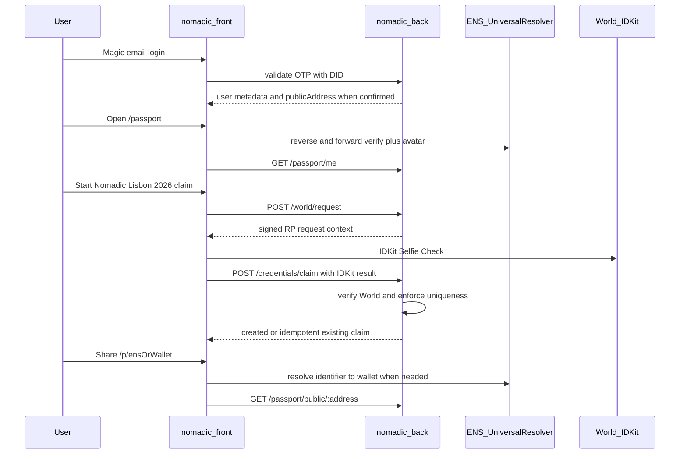

# Lisbon MVP — ETHGlobal Lisbon 2026

> Status: **product definition** (documentation only).  
> Authority: `docs/PROJECT_CONTEXT.md`, `docs/FRONTEND_AUDIT.md`, backend findings, final documentation corrections.  
> Branch: `lisboa2026`  
> No application code, package installs, schemas, or migrations ship with this document.

External technical references for ENS:

- Official ENS docs (Universal Resolver / resolution): https://docs.ens.domains/resolvers/universal/
- ENSv2 overview / preview materials: https://ens.domains/ensv2  
- ENSjs / viem resolution via the canonical Universal Resolver path

---

## 1. What we are shipping

A minimal **Nomadic Passport** demo that proves continuity of identity across communities:

1. A person signs in with existing **Magic** email auth.
2. They open a **Passport** that shows wallet-based identity and ENS as a human alias.
3. They claim **one** Lisbon credential that requires **World Selfie Check**.
4. The same **verified World identity** cannot create a second claim for the same credential action.
5. They share a **public Passport** URL associated with the wallet.

The product must not over-claim:

- Selfie Check verifies a World identity for a fixed action; it is **not** absolute proof of global unique-personhood beyond that verification model.
- Selfie Check does **not** prove ETHGlobal attendance, residency, or organizer-issued status.

---

## 2. Four product blocks

### 2.1 Identity

| Rule | Decision |
| --- | --- |
| Login | Keep **Magic** email OTP + DID Bearer validation (existing) |
| Canonical key | **Wallet address** is the stable identity key |
| ENS | Alias only: verified primary name, avatar, human-readable display, public lookup entry |
| ENS integration style | **ENSv2-ready application integration** via ENSjs + Universal Resolver (see architecture) |
| Not in scope | Replacing Magic; multi-wallet management; wallet-as-login; direct draft ENSv2 registry contracts |

**Wallet sourcing (P0):**

- Prefer `publicAddress` from **server-validated Magic metadata** when the installed Magic Admin/client SDKs actually provide it.
- Treat `User.publicAddress` as a **proposed nullable field** until a Magic wallet metadata readiness spike confirms the real response shape.
- Do **not** trust an arbitrary `walletAddress` from the claim request body as proof of ownership.
- Centralize wallet extraction; never log complete Magic metadata, DID tokens, or email addresses.
- If Magic does not provide a stable address: public Passport-by-wallet becomes available only after a later reliable wallet bind (documented at spike time).

### 2.2 Passport

Passport is **not** a new database entity for the MVP.

It is an **aggregated product view** of:

- user identity (Magic session / email-backed user);
- trusted wallet (`publicAddress` when bound);
- ENS data resolved at the frontend (never persisted in Nomadic DB for P0);
- new Lisbon `CredentialClaim` records;
- optional secondary listing of existing legacy proofs (`UserProofs`) if already present.

**Required routes:**

| Route | Audience |
| --- | --- |
| `/passport` | Authenticated owner |
| `/p/[identifier]` | Public; `identifier` = ENS-resolvable name **or** wallet address |

Internal public resolution (frontend / BFF only):

```text
identifier
  → normalize
  → if domain-like: ENS resolve name → wallet
  → if wallet: use normalized wallet
  → Express GET /passport/public/:address  (wallet only)
```

ENS may change owner over time; the wallet remains the stable retrieval key.

### 2.3 Credentials

| Layer | Term |
| --- | --- |
| User-facing UI | **Credential** |
| Internal / legacy code & DB | Keep existing **Proof** / `UserProofs` names |
| New Lisbon claims | New table **`CredentialClaim`** |

**P0 primary credential (honest naming):**

```text
credentialKey:   NOMADIC_LISBON_2026
displayName:     Nomadic Lisbon 2026
description:     A World Selfie Check–verified credential claimed through Nomadic during ETHGlobal Lisbon 2026.
```

**Requirement:** World Selfie Check for fixed allowlisted action `claim_nomadic_lisbon_2026`, with uniqueness scoped to the verified World identity for that action; one Nomadic user per credential key.

**Public disclosure (required before claim completion):**

- Explain that a successful claim will appear on a **publicly accessible Passport** associated with the wallet.
- Disclose which fields will be public (wallet, ENS alias when resolved client-side, credential display fields, claimedAt).
- Never expose email.
- Do not make the public route discoverable by email.

**Not for P0 as primary:**

- NFT/social marketplace-style proof lists dominating the UI.
- A credential named “ETHGlobal Lisbon Participant” without organizer evidence.

**Future credential keys** (only when attribute evidence exists):

```text
ETHGLOBAL_LISBON_2026_PARTICIPANT
HACKER_HOUSE_RESIDENT
EVENT_VOLUNTEER
COMMUNITY_CONTRIBUTOR
```

### 2.4 Public Profile

Public Passport shows:

- verified ENS name **or** truncated wallet;
- ENS avatar when available (avatar failure never breaks the page);
- wallet address;
- verified credentials (`CredentialClaim` list; Lisbon first);
- optional legacy proofs as a secondary “Other verifications” section if already present.

**Not shown:** email, social graph, reviews, reputation score, complex privacy controls, journey history in P0.

---

## 3. Exact user flow (demo script)

```text
1. Land on Nomadic → Nomad Email Login (Magic).
2. Backend validates DID and returns user; wallet bind only if Magic metadata spike confirms it.
3. App opens /passport (primary post-login destination for the demo).
4. Passport shows:
   - verified primary ENS name/avatar if reverse+forward checks succeed;
   - else truncated wallet;
   - credentials section with Nomadic Lisbon 2026 claim CTA or claimed state.
5. User opens claim flow; reads public-disclosure copy; continues.
6. Client requests RP signing context from backend (fixed action claim_nomadic_lisbon_2026).
7. Client opens supported IDKit Selfie Check flow.
8. Client sends complete IDKit result to claim endpoint.
9. Backend verifies with World, extracts action-scoped uniqueness value, stores CredentialClaim.
10. Passport refreshes and shows the credential as claimed.
11. User copies/opens /p/<ens-or-wallet>.
12. Visitor (no login) sees public Passport with the credential.
13. Same verified World identity / same user attempting a second claim for the same action
    gets idempotent success (already owned) or a clear uniqueness conflict.
```



---

## 4. In scope (P0)

- Magic auth reuse (no auth replacement).
- Magic wallet metadata readiness spike; proposed `User.publicAddress` only after confirmation.
- Private Passport page `/passport`.
- Public Passport `/p/[identifier]` with frontend/BFF ENS→wallet resolution.
- ENSv2-ready resolution via ENSjs + viem + Universal Resolver (no draft ENSv2 registry contracts).
- `NOMADIC_LISBON_2026` claim via World Selfie Check with server RP signing + server verification.
- `CredentialClaim` uniqueness after World readiness spike.
- Public disclosure before claim.
- Hide legacy house/NACC/single-use/journey-heavy CTAs from the **main demo path** (do not delete).
- Continuity documentation.

---

## 5. Out of scope (P0)

- New application or monorepo.
- Passport database entity.
- Persisting ENS names/avatars/text records in Nomadic DB.
- Direct interaction with draft ENSv2 Permissioned Registry / Resolver / ETH Registrar / migration contracts.
- Express-side ENS resolution.
- Renaming legacy Prisma models.
- Deleting journeys, houses, legacy proof verify UI.
- Showing journeys on the public Passport.
- Credential named ETHGlobal Participant without organizer evidence.
- Multi-wallet management; treating ENS as the database key.
- `@@unique([walletAddress, credentialKey])` before wallet ownership is proven.
- Walrus / Sui.
- Social graph, reviews, reputation scores, complex privacy.
- Deployable demo bypasses that mint fake World claims (`DEMO_WORLD_BYPASS` forbidden).
- Collecting or storing selfies, biometrics, documents, or full World payloads.
- Claiming absolute global unique-personhood beyond World’s verified action-scoped identity model.

---

## 6. Demo success criteria

1. **Login:** User completes Magic login and reaches `/passport`.
2. **Identity:** Passport shows a **verified** ENS primary name/avatar **or** a truncated wallet.
3. **Claim disclosure:** User sees public Passport disclosure before completing claim.
4. **Claim:** User claims **Nomadic Lisbon 2026** with Selfie Check once.
5. **Uniqueness:** The same verified World identity cannot create a second claim for the same credential action; same Nomadic user re-submit is idempotent.
6. **Public share:** `/p/[identifier]` loads without auth and shows the claimed credential (no email).
7. **Honesty:** UI copy does not claim ETHGlobal attendance or absolute global uniqueness beyond World verification.
8. **Continuity:** Judges can see pre-existing vs Lisbon-built work.

**Credible partial-demo failure modes:**

- ENS unavailable → truncated wallet; public route still works by address.
- World unavailable → honest unavailable state; pre-recorded successful demo; local-only test adapter that cannot be enabled in preview/production.

---

## 7. Constraints (team)

- One developer; incremental changes; keep the app deployable.
- Evolve `nomadic-front` + additive `nomadic-back`; no clean rewrite.
- Every sponsor integration (ENS, World) must serve this Passport story.
- Walrus and direct ENSv2 experimentation only after P0.

---

## 8. Related documents

| Doc | Purpose |
| --- | --- |
| [`LISBON_ARCHITECTURE.md`](./LISBON_ARCHITECTURE.md) | FE/BE split, ENSv2-ready strategy, World RP, schema |
| [`LISBON_ROUTES.md`](./LISBON_ROUTES.md) | Locked methods and contracts |
| [`LISBON_IMPLEMENTATION_PLAN.md`](./LISBON_IMPLEMENTATION_PLAN.md) | Build order, ENS tests, spikes |
| [`PREEXISTING_VS_LISBON.md`](./PREEXISTING_VS_LISBON.md) | Continuity honesty |
