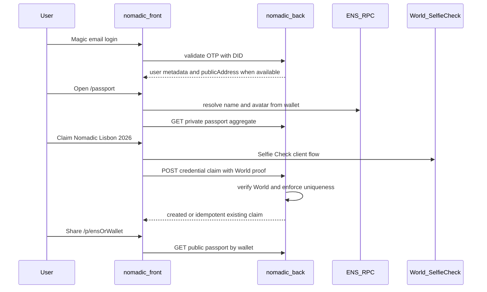

# Lisbon MVP — ETHGlobal Lisbon 2026

> Status: **product definition** (documentation only).  
> Authority: `docs/PROJECT_CONTEXT.md`, `docs/FRONTEND_AUDIT.md`, backend findings, revised plan feedback.  
> Branch: `lisboa2026`  
> No application code ships with this document.

---

## 1. What we are shipping

A minimal **Nomadic Passport** demo that proves continuity of identity across communities:

1. A person signs in with existing **Magic** email auth.
2. They open a **Passport** that shows wallet-based identity and ENS as a human alias.
3. They claim **one** Lisbon credential that requires **World Selfie Check**.
4. The same real person cannot claim that credential twice.
5. They share a **public Passport** URL.

The product must not over-claim. Selfie Check proves **unique-human claim eligibility**, not ETHGlobal attendance, residency, or organizer-issued status.

---

## 2. Four product blocks

### 2.1 Identity

| Rule | Decision |
| --- | --- |
| Login | Keep **Magic** email OTP + DID Bearer validation (existing) |
| Canonical key | **Wallet address** (`publicAddress`) is the stable identity key |
| ENS | Alias only: name, avatar, human-readable display, public lookup entry |
| Not in scope | Replacing Magic; multi-wallet account management; wallet-as-login |

**Wallet sourcing (P0):**

- Prefer `publicAddress` from **server-validated Magic metadata** and persist it on `User` when Magic Admin returns it stably.
- Do **not** trust an arbitrary `walletAddress` from the claim request body as proof of ownership.
- If Magic does not provide a stable address, document and implement: public Passport by wallet is available only after a claim that binds a wallet through a **reliable** mechanism (to be confirmed during backend implementation; not client-blind trust).

### 2.2 Passport

Passport is **not** a new database entity for the MVP.

It is an **aggregated product view** of:

- user identity (Magic session / email-backed user);
- wallet (`publicAddress`);
- ENS data (resolved from wallet);
- new Lisbon `CredentialClaim` records;
- optional secondary listing of existing legacy proofs (`UserProofs`) if already present.

**Required routes:**

| Route | Audience |
| --- | --- |
| `/passport` | Authenticated owner |
| `/p/[identifier]` | Public; `identifier` = ENS name **or** wallet address |

Internal public resolution:

```text
identifier
  → if ENS name: resolve to wallet
  → retrieve Passport aggregate by wallet
```

ENS may change owner over time; the wallet remains the stable retrieval key.

### 2.3 Credentials

| Layer | Term |
| --- | --- |
| User-facing UI | **Credential** |
| Internal / legacy code & DB | Keep existing **Proof** / `UserProofs` names |
| New Lisbon claims | New table **`CredentialClaim`** (do not force World uniqueness into `UserProofs`) |

**P0 primary credential (honest naming):**

```text
credentialKey:   NOMADIC_LISBON_2026
displayName:     Nomadic Lisbon 2026
description:     A unique-human credential claimed through Nomadic during ETHGlobal Lisbon 2026.
```

**Requirement:** World Selfie Check + uniqueness (one real human per credential; one user per credential).

**Not for P0 display as primary:**

- NFT/social marketplace-style proof lists dominating the UI.
- A credential named “ETHGlobal Lisbon Participant” (would require organizer evidence: QR, check-in, allowlist, or issuer attestation).

**Future credential keys** (only when attribute evidence exists):

```text
ETHGLOBAL_LISBON_2026_PARTICIPANT
HACKER_HOUSE_RESIDENT
EVENT_VOLUNTEER
COMMUNITY_CONTRIBUTOR
```

### 2.4 Public Profile

Public Passport shows:

- ENS name **or** truncated wallet;
- ENS avatar when available;
- wallet address;
- verified credentials (`CredentialClaim` list; Lisbon first);
- optional legacy proofs as a secondary “Other verifications” section if already present.

**Not shown:** social graph, reviews, reputation score, complex privacy controls, journey history in P0 (journeys are not reliably public today).

---

## 3. Exact user flow (demo script)

```text
1. Land on Nomadic → Nomad Email Login (Magic).
2. Backend validates DID and returns / persists user (+ publicAddress when available).
3. App opens /passport (primary post-login destination for the demo).
4. Passport shows:
   - ENS name/avatar if resolvable from wallet;
   - else truncated wallet;
   - credentials section with Nomadic Lisbon 2026 claim CTA or claimed state.
5. User opens claim flow for Nomadic Lisbon 2026.
6. User completes World Selfie Check (client).
7. Frontend sends proof to backend claim endpoint.
8. Backend verifies World proof server-side, enforces uniqueness, stores CredentialClaim.
9. Passport refreshes and shows the credential as claimed.
10. User copies/opens /p/<ens-or-wallet>.
11. Visitor (no login) sees public Passport with the credential.
12. Same human / same user attempting a second claim gets an idempotent success
    (already owned) or a clear conflict if uniqueness is violated by another account.
```



---

## 4. In scope (P0)

- Magic auth reuse (no auth replacement).
- Persist wallet on `User` when Magic metadata supplies it (additive field).
- Private Passport page `/passport`.
- Public Passport `/p/[identifier]` with ENS→wallet resolution.
- ENS name + avatar display and lookup.
- `NOMADIC_LISBON_2026` claim via World Selfie Check.
- Server-side World verification + uniqueness via `CredentialClaim`.
- Hide legacy house/NACC/single-use/journey-heavy CTAs from the **main demo path** (do not delete).
- Continuity documentation (`PREEXISTING_VS_LISBON.md` and related docs).

---

## 5. Out of scope (P0)

- New application or monorepo.
- Passport database entity.
- Renaming legacy Prisma models (`UserProofs`, Journey, etc.).
- Deleting journeys, houses, legacy proof verify UI.
- Showing journeys on the public Passport.
- Credential named ETHGlobal Participant without organizer evidence.
- Multi-wallet management; treating ENS as the database key.
- `@@unique([walletAddress, credentialKey])` before wallet ownership is proven.
- Walrus / Sui.
- Social graph, reviews, reputation scores, complex privacy.
- Deployable demo bypasses that mint fake World claims (`DEMO_WORLD_BYPASS` forbidden).
- Collecting or storing selfies, biometrics, documents, or full World payloads.

---

## 6. Demo success criteria

The demo succeeds when all of the following are true:

1. **Login:** User completes Magic login and reaches `/passport`.
2. **Identity:** Passport shows ENS name/avatar **or** a truncated wallet (honest fallback if ENS fails).
3. **Claim:** User claims **Nomadic Lisbon 2026** with Selfie Check once.
4. **Uniqueness:** A second claim by the same real person / same user does not create a duplicate row (idempotent return or clear conflict UX).
5. **Public share:** `/p/[identifier]` loads without auth and shows the claimed credential.
6. **Honesty:** UI copy does not claim ETHGlobal attendance or organizer issuance.
7. **Continuity:** Judges can see what was pre-existing vs Lisbon-built (`PREEXISTING_VS_LISBON.md`).

**Failure modes that still allow a credible partial demo:**

- ENS unavailable → show truncated wallet; public route still works by address.
- World unavailable → honest unavailable state; use a **pre-recorded successful demo** (video/screens) and a **local-only** test adapter that cannot be enabled in preview/production builds.

---

## 7. Constraints (team)

- One developer; incremental changes; keep the app deployable.
- Evolve `nomadic-front` + additive `nomadic-back`; no clean rewrite.
- Every sponsor integration (ENS, World) must serve this Passport story.
- Walrus only after P0 is complete (optional later).

---

## 8. Related documents

| Doc | Purpose |
| --- | --- |
| [`LISBON_ARCHITECTURE.md`](./LISBON_ARCHITECTURE.md) | FE/BE split, schema, flows |
| [`LISBON_ROUTES.md`](./LISBON_ROUTES.md) | Pages and API contracts |
| [`LISBON_IMPLEMENTATION_PLAN.md`](./LISBON_IMPLEMENTATION_PLAN.md) | P0/P1/P2 tasks |
| [`PREEXISTING_VS_LISBON.md`](./PREEXISTING_VS_LISBON.md) | Continuity honesty |
